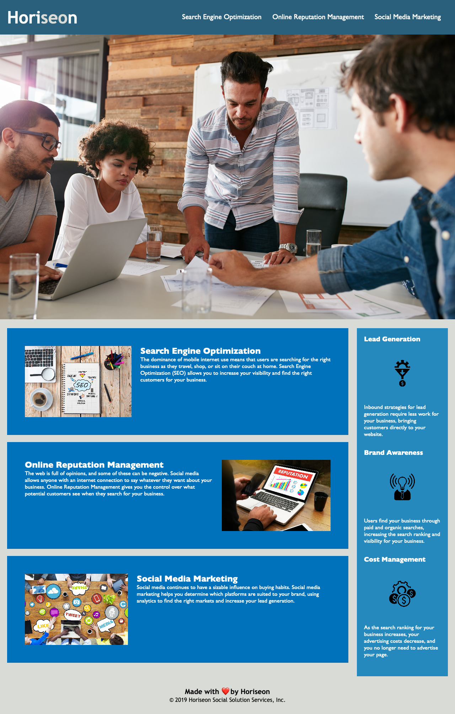

# Horiseon
> Website with navigation

## Table of contents
* [General info](#general-info)
* [Screenshots](#screenshots)
* [Setup](#setup)
* [Status](#status)
* [Contact](#contact)

## General info
Updated a marketing agency website that needed to update their codebase to follow accessibility standards and is optimized for search engines.

## Screenshots

## Setup

1. Navigate to the main page of the respository
2. Under the repository name, click Clone or download
3. In the Clone with HTTPSs section, click the copy
4. Open Terminal
5. Change the current working directory to the location where you want the cloned directory to be made.
6. Type ‘git clone’ and then paste the URL you copied
- $ git clone https://github.com/aidabyte/code-reflector-hw.git
7. Press Enter. Your local clone will be created.

## Code Examples
Show examples of usage:
<!DOCTYPE html>
<html lang="en-us">

<head>
    <meta charset="UTF-8" />
    <link rel="stylesheet" href="./assets/css/style.css">
    <!-- This is where the name of the company goes -->
    <title>Horiseon</title>
</head>

<body>
        

            <h1>Horiseon</h1>
            
           
                <ul>
                    <!-- This is where you navigate within the website -->
                    <li>
                        <a href="#search-engine-optimization">Search Engine Optimization</a>
                    </li>
                    <li>
                        <a href="#online-reputation-management">Online Reputation Management</a>
                    </li>
                    <li>
                        <a href="#social-media-marketing">Social Media Marketing</a>
                    </li>
                </ul>
            
       
        

   

    

    

    
        

            <!-- content-img and mh-200 are the reference tags for css and the space seperates the two tags -->
            
 
                <!-- alt provides for the accesibility standards -->
                
                <!-- Make sure the id matches to the anchor tag above -->
                <h2 id="search-engine-optimization">Search Engine Optimization</h2> 
                

                    The dominance of mobile internet use means that users are searching for the right business as they travel, shop, or sit on their couch at home. Search Engine Optimization (SEO) allows you to increase your visibility and find the right customers for your business.
                

            

             <!-- content-img and mh-200 are the reference tags for css and the space seperates the two tags -->
            

                <!-- alt provides for the accesibility standards -->
                
                <!-- Make sure the id matches to the anchor tag above -->
                <h2 id="online-reputation-management">Online Reputation Management</h2> 
                

                    The web is full of opinions, and some of these can be negative. Social media allows anyone with an internet connection to say whatever they want about your business. Online Reputation Management gives you the control over what potential customers see when they search for your business.
                

            

             <!-- content-img and mh-200 are the reference tags for css and the space seperates the two tags -->
            

                <!-- alt provides for the accesibility standards -->
                
                <!-- Make sure the id matches to the anchor tag above -->
                <h2 id="social-media-marketing">Social Media Marketing</h2> 
                

                    Social media continues to have a sizable influence on buying habits. Social media marketing helps you determine which platforms are suited to your brand, using analytics to find the right markets and increase your lead generation.
                

            

        

    

         <!-- Benefits-img and mb-32 are the reference tags for css and the space seperates the two tags -->
        

            <h3>Lead Generation</h3>
            <!-- alt provides for the accesibility standards -->
              
            

                Inbound strategies for lead generation require less work for your business, bringing customers directly to your website.
            

        

        <!-- Benefits-img and mb-32 are the reference tags for css and the space seperates the two tags -->
        

            <h3>Brand Awareness</h3>
            <!-- alt provides for the accesibility standards -->
            
            

                Users find your business through paid and organic searches, increasing the search ranking and visibility for your business.
            

        

        <!-- Benefits-img and mb-32 are the reference tags for css and the space seperates the two tags -->
        

            <h3>Cost Management</h3>
            <!-- alt provides for the accesibility standards -->
            
            

                As the search ranking for your business increases, your advertising costs decrease, and you no longer need to advertise your page.
            

        

    

</body>

    <h2>Made with ❤️️ by Horiseon</h2>
    

        &copy; 2019 Horiseon Social Solution Services, Inc.
    

</html>

* {
    box-sizing: border-box;
    padding: 0;
    margin: 0;
}

body {
    background-color: #d9dcd6;
}

.header {
    padding: 20px;
    font-family: 'Trebuchet MS', 'Lucida Sans Unicode', 'Lucida Grande', 'Lucida Grande', 'Lucida Sans', 'Lucida Sans Regular', 'Lucida Grande', 'Lucida Sans', Arial, sans-serif;
    background-color: #2a607c;
    color: #ffffff;
}

/* This selects the h1 title in the header */
.header h1 {
    display: inline-block;
    font-size: 48px;   
}

.header h1 .seo {
    color: #d9dcd6;
}

.header div {
    padding-top: 15px;
    margin-right: 20px;
    float: right;
    font-family: 'Gill Sans', 'Gill Sans MT', Calibri, 'Trebuchet MS', sans-serif;
    font-size: 20px;
}

.header div ul li {
    display: inline-block;
    margin-left: 25px;
}

/* These are the functioning elements of the page */
a {
    color: #ffffff;
    text-decoration: none;
}

p {
    font-size: 16px;
}

.h2 { margin-bottom: 20px;
    font-size: 36px;
}

.h3 {
    margin-bottom: 10px;
    text-align: center; 
}

.hero {
    height: 800px;
    width: 100%;
    margin-bottom: 25px;
    background-image: url("../images/digital-marketing-meeting.jpg");
    background-size: cover;
    background-position: center;
}

.float-left {
    float: left;
    margin-right: 25px;
}

.float-right {
    float: right;
    margin-left: 25px;
}

.content {
    width: 75%;
    display: inline-block;
    margin-left: 20px;
}

/* created this class to refer to the image */
.content-img img {
    max-height: 200px;
}

/* created another new class for reference */
.mh-200{
    margin-bottom: 20px;
    padding: 50px;
    height: 300px;
    font-family: 'Gill Sans', 'Gill Sans MT', Calibri, 'Trebuchet MS', sans-serif;
    background-color: #0072bb;
    color: #ffffff;
}
    
.benefits {
    margin-right: 20px;
    padding: 20px;
    clear: both;
    float: right;
    width: 20%;
    height: 100%;
    font-family: 'Gill Sans', 'Gill Sans MT', Calibri, 'Trebuchet MS', sans-serif;
    background-color: #2589bd;
}

/* created another new class for reference */
.mb-32 { 
    margin-bottom: 32px;
    color: #ffffff;
}  
/* created another new class for reference */
.benefit-img img{
    display: block;
    margin: 10px auto;
    max-width: 150px;
}

.footer {
    padding: 30px;
    clear: both;
    font-family: 'Trebuchet MS', 'Lucida Sans Unicode', 'Lucida Grande', 'Lucida Sans', Arial, sans-serif;
    text-align: center;
}

.footer h2 {
    font-size: 20px;
}

## Status
Project is: _in progress_ because I am still learning.

## Contact
Created by [@aida](https://github.com/aidabyte) - feel free to contact me!
